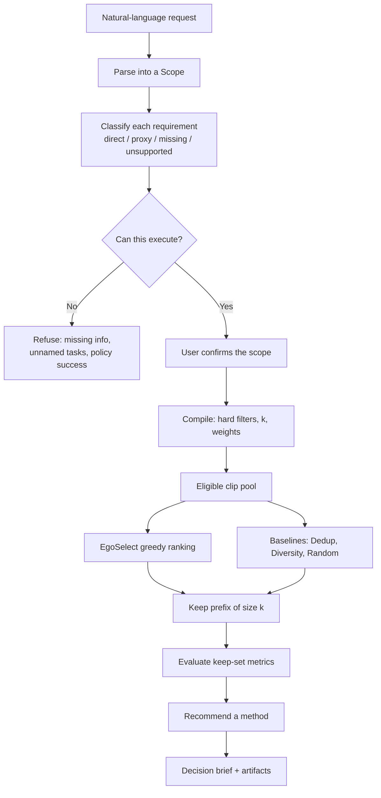

# EgoScope

**Keep the clips that teach the robot.**

EgoScope turns a natural-language curation request into a confirmed, measurable scope, then ranks first-person clips so you can train on a smaller, better set.

Robots learn from egocentric video, but most of it is waiting around, near-copies, and the same motion again. Training on all of it is slow. Training on the wrong clips teaches the wrong habits.

## What it does

You write what to keep. EgoScope checks whether that request can be measured from the footage, then scores every clip and returns a keep-set, a comparison, and a brief.

Each clip is scored on four measurements from the recording itself:

| Measurement | What it captures |
| --- | --- |
| Waiting-around | How much of the clip the camera is sitting still (pose speed) |
| Clean motion | Missing frames, broken pose tracks, and whether any motion happened |
| Variety of motion | Whether this clip is a kind of movement you do not already have |
| Repeats | Whether this clip looks like one you already kept |

The selector, **EgoSelect**, does not score once and sort. After every pick it rescores the remaining candidates against the set already kept.

Supported request types:

- Keep a fraction or a count of clips
- Find a smallest set that still covers the motion range
- Compare two keep amounts or two picking methods
- See which clips get picked across strategies
- Describe the dataset

Requests that need object names, task labels, or robot success are refused. The demo cannot recognize drawers, kitchens, or whether a policy would succeed.

## System flow

A run never jumps from raw text to a keep-set. The request is scoped, checked against a signal registry, compiled into selector weights, then ranked. The LLM (if present) may only propose JSON; it cannot change scores, winners, or the brief arithmetic.



1. **Ask.** `requirements/parser.py` turns text into a `Scope`: request type, budget, hard constraints, soft priorities. Fixture matches and heuristics run with no LLM. An optional OpenAI-compatible client may propose JSON that is still schema-validated.
2. **Check.** `requirements/feasibility.py` maps each requirement onto `configs/signal_registry.yaml`. Direct signals (budget, idle, quality) can execute. Coverage and redundancy are proxies. Semantic tasks, objects, environments, and policy success are blocked.
3. **Compile.** `requirements/compiler.py` applies hard filters (for example `stationary_ratio ≤ 0.25`), chooses a weight profile from the priorities, and resolves keep size \(k\).
4. **Select.** `egoselect/selector.py` ranks every eligible clip. After each pick, remaining candidates are rescored against the set already kept. There is no score-once-then-sort path.
5. **Compare.** Equal-budget baselines run on the same pool. Metrics in `egoselect/metrics.py` score the keep-set. `analysis/recommend.py` picks a winner from measured numbers only.
6. **Report.** `analysis/brief.py` writes a decision brief. Artifacts land under `outputs/runs/<run_id>/`.

The UI follows the same path: **Ask** posts `/api/scope`, **Check** lets you edit and confirm the scope, **Results** posts `/api/runs`. **Watch the map** is a static explorer over a precomputed payload and does not call the selector.

## Algorithm and formulas

EgoSelect is greedy marginal selection on a per-clip value that mixes quality, coverage gain, and redundancy. Quality is a property of the clip. Coverage gain and redundancy depend on the keep-set \(S\), so they are recomputed after every pick.

### Clip representation

Each episode \(i\) has a visual embedding (DINOv2-small over 8 sampled RGB frames) and a motion vector (path length, speeds, idle ratio, and related trajectory stats). These are reduced and concatenated into a representation \(z_i\):

\[
z_i = \mathrm{StandardScaler}\big(\,[\,\mathrm{PCA}_{16}(v_i) \,\|\, \mathrm{StandardScaler}(m_i)\,]\,\big)
\]

Behavioral regions are KMeans partitions of \(z\) (\(k=6\), seed 42). They are unsupervised visual-motion clusters, not named robot skills. The 2D map is \(\mathrm{PCA}_2(z)\).

Idle uses wrist-pose speed. A step is stationary if speed \(< 0.02\,\mathrm{m/s}\):

\[
\mathrm{stationary\_ratio}_i = \frac{1}{T}\sum_t \mathbf{1}[\,s_{i,t} < 0.02\,]
\]

### Quality

Quality does not depend on \(S\). It is a weighted mix of recording usability, then min-max normalized so higher is better:

\[
\begin{aligned}
Q_i &= 0.25\,q^{\mathrm{frames}}_i
     + 0.25\,q^{\mathrm{complete}}_i
     + 0.20\,q^{\mathrm{finite}}_i
     + 0.15\,(1 - \mathrm{stationary\_ratio}_i)
     + 0.15\,q^{\mathrm{temporal}}_i \\
\tilde{Q}_i &= \frac{Q_i - \min_j Q_j}{\max_j Q_j - \min_j Q_j}
\end{aligned}
\]

where \(q^{\mathrm{frames}}\) is decoded/sampled RGB frames, \(q^{\mathrm{complete}}\) is the worse of the two arms’ valid-pose coverage, \(q^{\mathrm{finite}}\) is the share of finite poses, and \(q^{\mathrm{temporal}}\) is 1 if the clip has more than one frame and a known FPS.

### Coverage gain

Coverage gain is how much new behavior \(i\) would add to \(S\):

\[
\mathrm{CoverageGain}(i \mid S)
  = 0.50\,\mathrm{new\_region}
  + 0.30\,\mathrm{distance}
  + 0.20\,\mathrm{balance}
\]

If \(S\) is empty, all three parts are 1. Otherwise:

\[
\begin{aligned}
\mathrm{new\_region}(i \mid S)
  &= \mathbf{1}[\,r_i \notin \{r_j : j \in S\}\,] \\
\mathrm{distance}(i \mid S)
  &= \mathrm{clip}\!\left(\frac{\min_{j \in S}\|z_i - z_j\|_2}{d_{\mathrm{scale}}}, 0, 1\right) \\
\mathrm{balance}(i \mid S)
  &= 1 - \frac{|\{j \in S : r_j = r_i\}|}{|S|}
\end{aligned}
\]

\(r_i\) is the KMeans region of clip \(i\). \(d_{\mathrm{scale}}\) is the median pairwise \(\ell_2\) distance over all \(z\) in the pool, so distance is relative to the dataset, not an absolute meter scale.

### Redundancy

Redundancy is nearest-neighbor cosine similarity in unit-\(z\) space. Empty \(S\) scores 0:

\[
R(i \mid S) = \max_{j \in S} \hat{z}_i^\top \hat{z}_j,
\qquad \hat{z} = z / \|z\|_2
\]

### Value and greedy ranking

Default **balanced** weights are \(\alpha=0.35\), \(\beta=0.45\), \(\gamma=0.20\):

\[
V(i \mid S) = \alpha\,\tilde{Q}_i + \beta\,\mathrm{CoverageGain}(i \mid S) - \gamma\,R(i \mid S)
\]

The selector starts with \(S = \emptyset\) and repeats until every eligible clip is ranked:

1. For each remaining candidate, recompute \(\mathrm{CoverageGain}\) and \(R\) against current \(S\).
2. Pick \(\arg\max_i V(i \mid S)\), breaking ties by `episode_hash`.
3. Add that clip to \(S\).

The keep-set is the first \(k\) ranks. Budget \(k = \mathrm{round}(n \cdot f)\) clipped to \([1, n]\) for a keep fraction \(f\), or an explicit episode count.

A **smallest covering set** uses the same order and stops at the first prefix whose regions cover every region in the pool.

### Weight profiles

Soft priorities in the confirmed scope pick a row from `configs/strategy_profiles.yaml`:

| Profile | \(\alpha\) quality | \(\beta\) coverage | \(\gamma\) redundancy |
| --- | ---: | ---: | ---: |
| balanced | 0.35 | 0.45 | 0.20 |
| quality_first | 0.60 | 0.25 | 0.15 |
| coverage_first | 0.20 | 0.65 | 0.15 |
| dedup_first | 0.20 | 0.25 | 0.55 |

If one priority is uniquely high, that profile wins. Otherwise the run stays balanced.

### Baselines

The same greedy loop, different objective:

| Method | Objective at each step |
| --- | --- |
| EgoSelect | \(V = \alpha\tilde{Q} + \beta\,\mathrm{CoverageGain} - \gamma R\) |
| Diversity-only | \(V = \mathrm{CoverageGain}\) |
| Dedup-only | \(V = -R + 10^{-6}\,\tilde{Q}\) |
| Random | permutation; reported as mean/min/max over seeds 42–46 |

### Keep-set metrics

For a keep-set \(K\) against universe \(U\):

\[
\begin{aligned}
\mathrm{region\_coverage}(K)
  &= \frac{|\{r_i : i \in K\}|}{|\{r_i : i \in U\}|} \\
\mathrm{average\_quality}(K)
  &= \frac{1}{|K|}\sum_{i \in K} Q_i \\
\mathrm{nn\_redundancy}(K)
  &= \frac{1}{|K|}\sum_{i \in K} \max_{j \in K \setminus \{i\}} \hat{z}_i^\top \hat{z}_j \\
\mathrm{visual\_coverage}(K)
  &= \frac{1}{|U|}\sum_{i \in U} \max_{j \in K} \cos(v_i, v_j)
\end{aligned}
\]

`motion_coverage` is the same mean-max cosine on the motion vectors. `stationary_content_ratio` is the mean idle fraction in \(K\). Task/scene/lab/operator diversity, when those columns exist, is held-out label coverage and is not used to rank.

### Recommendation

After methods are scored, `analysis/recommend.py` chooses a winner from the measured table. Coverage-first ranks by region coverage then quality. Dedup-first ranks by lowest nearest-neighbor redundancy then quality. Other profiles use a min-max normalized mix of the same three metrics with the confirmed weights. Ties closer than 0.01 are reported as ties. The LLM cannot override this.

Per-clip KEEP/DROP copy is also rule-based: new vs already-covered region, high quality (\(\tilde{Q} \ge 0.80\)), high redundancy (\(R \ge 0.70\)), and idle share.

## Repository layout

```
egoscope/         FastAPI service and run pipeline
egoselect/        Greedy ranking, features, metrics, baselines
requirements/     Request parser, signal registry, feasibility, compiler
analysis/         Method comparison, recommendation rules, decision brief
configs/          Example requests, strategy profiles, signal registry
web/              React + Vite UI (Ask → Check → Results, plus a behavior map)
scripts/          Local API, CLI scoping, selection, experiments
outputs/          Bundled 80-clip feature table and demo payload
tests/            Parser, API, golden, and end-to-end tests
```

Generated run artifacts land in `outputs/runs/` (gitignored). EgoVerse checkouts and raw episode caches belong in `third_party/` and `data/` and are not vendored.

## Quick start

Requires Python 3.10+ and Node 18+.

```bash
python3 -m venv .venv
source .venv/bin/activate
pip install -r requirements.txt

cd web
npm install
cd ..
```

### Web app

Start the API, then the UI. Vite proxies `/api` to the backend.

```bash
python scripts/serve.py          # http://127.0.0.1:8000
cd web && npm run dev            # http://127.0.0.1:5173
```

Open [http://127.0.0.1:5173](http://127.0.0.1:5173). Try a request such as:

> Keep 30%, skip idle clips, and cover as many kinds of motion as we can.

The UI walks **Ask → Check → Results**. Confirm the parsed scope before a run. **Watch the map** shows the same 80 bundled clips as a behavior canvas.

### CLI

Parse a request into a proposed scope:

```bash
python scripts/scope_request.py "Keep 30% while balancing quality, visual-motion coverage, and redundancy."
```

Confirm a scope and run EgoSelect plus baselines:

```bash
python scripts/run_scoped_selection.py "Keep 20 episodes and exclude trajectories with more than 25% stationary behavior."
```

Rank the bundled table, sweep methods and budgets, or export the static explorer payload:

```bash
python scripts/run_selection.py
python scripts/run_experiment.py
python scripts/export_demo.py
```

Print a saved run's decision brief:

```bash
python scripts/generate_brief.py <run_id>
```

## Tests

```bash
source .venv/bin/activate
pytest
```

The end-to-end tests run against the bundled 80-episode feature table at `outputs/episode_features.parquet`.

## Bundled demo

This checkout includes an 80-clip feature table so the app and tests run without downloading EgoVerse. Coverage here is unsupervised visual-motion regions, not named robot skills.

Optional: an OpenAI-compatible parser can propose JSON from a request. That proposal is still schema- and registry-validated; fixture matches and heuristics work with no LLM.

## License

No license file is included yet. All rights reserved unless you add one.
