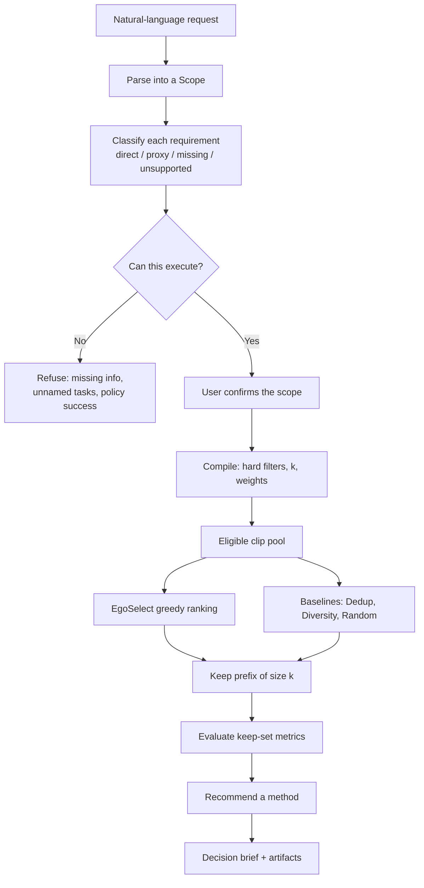

# EgoScope

**Keep the clips that teach the robot.**

Most first-person robot video is waiting, repeats, and the same motion again. EgoScope takes a keep-request in plain language, checks that it can measure it from the footage, then ranks clips and returns a smaller training set.

It scores four things: idle time, clean motion, new kinds of movement, and near-copies. It cannot recognize objects, task names, or whether a robot would succeed.

The demo ships 80 clips, so nothing extra needs to be downloaded.

## Demo

<video src="https://github.com/user-attachments/assets/8a6a6c61-61b0-4dcd-86e3-5e64cb338dc4" controls muted playsinline width="100%"></video>

## Flow



The UI follows the same path: **Ask** posts `/api/scope`, **Check** lets you edit and confirm the scope, **Results** posts `/api/runs`. **Watch the map** is a static view of the same 80 clips.

## Ranking

Each remaining clip $i$ gets a score against the current keep-set $S$:

$$
V(i \mid S) = 0.35\,\tilde{Q}_i + 0.45\,\mathrm{CoverageGain}(i \mid S) - 0.20\,R(i \mid S)
$$

- $\tilde{Q}$ — recording quality (valid frames, pose tracks, not sitting still), scaled 0–1.
- $\mathrm{CoverageGain}$ — does this clip add a new motion cluster, sit far from clips already kept, and avoid overfilling one cluster.
- $R$ — how similar this clip is to the nearest clip already kept.

After every pick, coverage and repeats are recomputed. The keep-set is the first $k$ clips in that order.

Other weight mixes (favor quality, coverage, or fewer repeats) live in `configs/strategy_profiles.yaml`. Drop-duplicates uses $-R$; spread-motion uses coverage gain only.

## Run

Python 3.10+ and Node 18+.

```bash
python3 -m venv .venv && source .venv/bin/activate
pip install -r requirements.txt
cd web && npm install && cd ..

python scripts/serve.py          # API at :8000
cd web && npm run dev            # UI at :5173
```

```bash
python scripts/scope_request.py "Keep 30%, skip idle clips, cover more kinds of motion."
pytest
```

## Layout

```
egoscope/      API and run pipeline
egoselect/     ranking, features, baselines
requirements/  request parser and checks
analysis/      comparison and brief
web/           Ask → Check → Results UI
outputs/       bundled 80-clip table
docs/          README demo video
```
